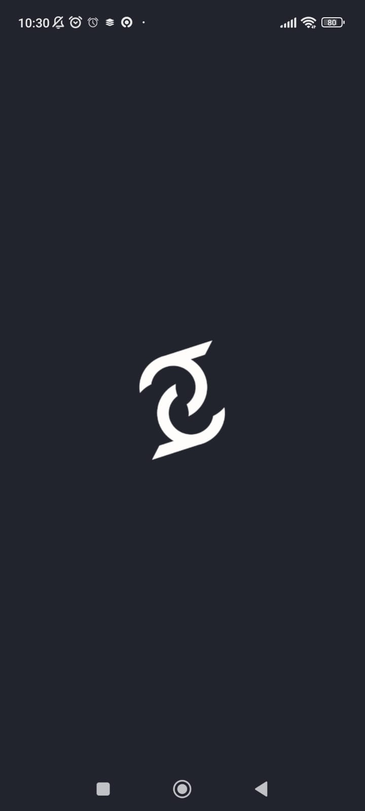

# ThriveIn :octocat:
**ThriveIn** is a store detection application designed to provide guidance and instructions aimed at enhancing Micro, Small, and Medium Enterprises (UMKM). This innovative application utilizes advanced technology to identify, offer valuable insights in the form of articles, provide service offerings, and give instructions to support the growth and development of **UMKM**. 

<b>ThriveIn</b> serves as a strategic tool for empowering local businesses by providing the necessary information and resources to thrive in the competitive market. Through its user-friendly interface, this application offers tailored recommendations and assistance, contributing to the overall improvement and success of <b>UMKM</b> in various industries.

## Table of Contents
1. [Technology](#technology)
2. [Features](#features)
3. [Screenshots](#screenshots)
4. [Logo](#logo)
5. [Documentation](#documentation)

## Technology 
This project utilizes Jetpack Compose with the Kotlin language and Android Jetpack library to build a declarative user interface. The Compose Runtime Library serves as an infrastructure provider for efficient UI and state management. The use of Kotlin Coroutines supports asynchronous operations, while integration with Material Design ensures a consistent and appealing UI.

### Note
>This Project is a beta release and for next project it will release feature for .......Tnya ml ya

## Features 
* Login and Register
  * Authentification user
* Detect Store
  * Analyzing store images for minimal standard identification
  * Displaying identification results and providing recommendations for the store
  * Uploading images can via front and rear cameras
  * Accessible upload from gallery 
* Service Transaction
    * Viewing the list of services
  * Users can choose transactions
  * Service details can be viewed
  * All portfolios are accessible
  * Reordering transactions
  * Order later transaction wich is been save in waiting list
* Consultation
  * Chat with Admin in general
  * Share images while chatting
  * Admin consultation for each transaction
* Setting Screen  
  * Edit profiles for store and personal profiles
  * Logout account and delete account
  * For FAQ, T&C, Our website can direct to website <a href="https://thrivein.id/" target="_blank">ThriveIn.id</a>
* History Screen
    * Storing each consultation transaction
    * Display all history transaction
    * Detail history transaction
* Waiting Screen
    * Display all waiting list transaction 
    * Detail waiting list transaction
    * Delete and order of the waiting transaction
* Languange
    * Can change depending on the default language of the phone

## Screenshots 

    
     
     
    
    
        
         
    
     
      
     
    
    
    
       
    
     
     
     
    

## Logo 

     

## Documentation 
* Design UI/UX: <a href="https://www.figma.com/file/62OyW5VoVbrRuJ0rrcTisD/Thrive-In-UI%2FUX-Design?type=design&node-id=254-8359&mode=design&t=GR1X01t4Zn0SKK3u-0" target="_blank">Figma ThriveIn</a>
* Demo App [Youtube ThriveIn]()
* Demo Video [Ads ThriveIn]()
* Social Media: <a href="https://www.instagram.com/thrivein._/" target="_blank">Instagram ThriveIn</a>
* Our Website: <a href="https://thrivein.id/" target="_blank">ThriveIn.id</a>
